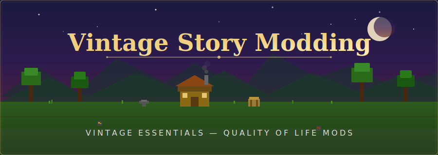

<p align="center">
  
</p>

<p align="center">
  <a href="mods/VintageEssentials/"></a>
  <a href="#"></a>
  <a href="LICENSE"></a>
  <a href="mods/VintageEssentials/CHANGELOG.md"></a>
</p>

<p align="center">
  <i>🏗️ A multi-mod repository for Vintage Story — quality of life improvements, crafting enhancements, and essential commands.</i>
</p>

---

## ✨ Features at a Glance

<table>
<tr>
<td width="50%">

### 🏠 Teleportation Commands
- **`/sethome`** — Save your home location
- **`/home`** — Warp back instantly
- **`/rtp <direction>`** — Random teleport 3k–10k blocks

</td>
<td width="50%">

### 🔨 Portable Crafting Table
- Placeable 3×3 crafting grid with 72-slot storage
- **Cloud Crafting** — pull ingredients from nearby chests
- **Handbook Integration** — browse & auto-fill recipes
- Pick up with contents preserved

</td>
</tr>
<tr>
<td width="50%">

### 📦 Chest Radius Inventory
- Scan nearby containers (15-block radius)
- Search, sort, deposit all, take all
- Real-time item aggregation

</td>
<td width="50%">

### ⚙️ Quality of Life
- **Inventory Sorting** — sort by name, quantity, or type
- **Slot Locking** — protect important items
- **Stack Size Multiplier** — configurable up to 200×
- **Keybind Customization** — full GUI configuration

</td>
</tr>
<tr>
<td colspan="2">

### 🗂️ Conglomerate Mod Management
- **Tabbed Config Dialog** — 10-tab interface (General + 9 mod categories)
- **77 Community Mods** — curated collection organized by category
- **Per-Mod Toggles** — enable/disable individual mods with toggle switches
- **Bulk Actions** — Enable All / Disable All per category
- **Persistent Settings** — mod states saved across sessions

</td>
</tr>
</table>

---

## 📂 Repository Structure

```
VINTAGE-ESSENTIALS/
├── mods/
│   ├── VintageEssentials/          🎮 Quality of life mod
│   │   ├── src/                    📝 C# source code
│   │   ├── assets/                 🎨 Game assets (patches, shapes, lang)
│   │   ├── modinfo.json            📋 Mod metadata
│   │   ├── VintageEssentials.csproj
│   │   ├── CHANGELOG.md
│   │   └── PORTABLE_CRAFTING_SPEC.md
│   └── Conglomerate/               📦 77 curated community mods
├── assets/                         🖼️ Repository assets (banner, images)
├── MODDING_GUIDELINES.md           📖 Shared modding reference
├── ASSET_GENERATION.md             🎨 Asset creation guide
├── LICENSE
└── README.md
```

## 🎮 Mods

| Mod | Description | Folder |
|:---:|-------------|:------:|
| **[Vintage Essentials](mods/VintageEssentials/)** | Essential commands and quality of life improvements including `/home`, `/sethome`, `/rtp`, chest radius inventory, inventory sorting, slot locking, configurable stack sizes, and portable crafting table with cloud crafting, handbook integration, and block portability | `mods/VintageEssentials/` |
| **Conglomerate Collection** | 77 curated community mods organized into 9 categories (Storage, Cooking, Hunting, Building, Crafting, Combat, World & Exploration, Quality of Life, Libraries) — managed through the in-game tabbed config dialog | `mods/Conglomerate/` |

## 🚀 Getting Started

Each mod is self-contained in its own folder. To work on a specific mod:

```bash
cd mods/VintageEssentials
dotnet build
```

To add a new mod, create a new folder under `mods/`:

```bash
mkdir mods/YourNewMod
```

Then set up the standard Vintage Story mod structure inside it (see [MODDING_GUIDELINES.md](MODDING_GUIDELINES.md) for details).

## 📖 Shared Modding Resources

These reference documents apply to all mods in the repository:

| Resource | Description |
|:---------|:------------|
| 📘 **[MODDING_GUIDELINES.md](MODDING_GUIDELINES.md)** | Comprehensive modding guidelines — asset system, JSON patching, code patterns, troubleshooting |
| 🎨 **[ASSET_GENERATION.md](ASSET_GENERATION.md)** | Asset creation guide — textures, 3D models, items, blocks, recipes, sounds, localization |

## 📜 License

See [LICENSE](LICENSE) file for details.
